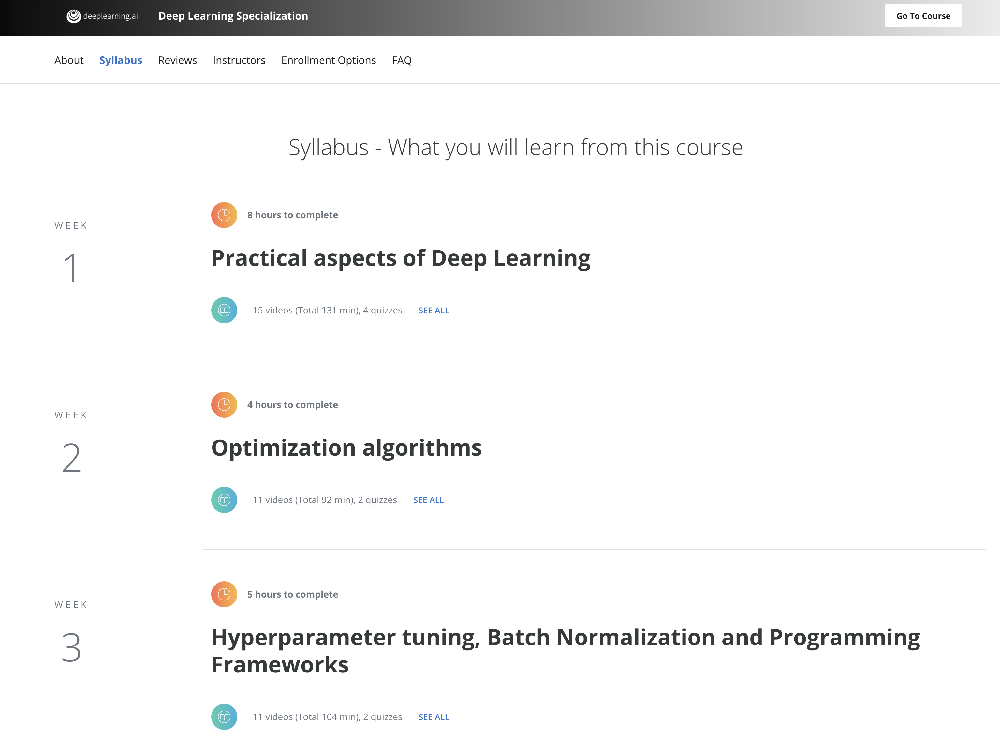
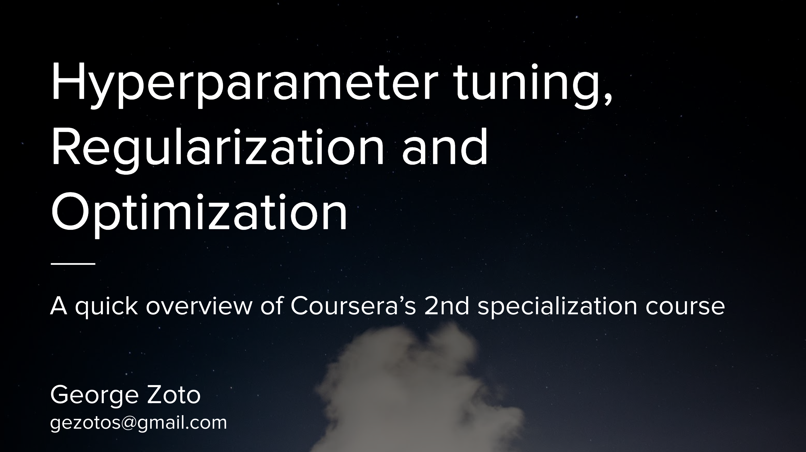
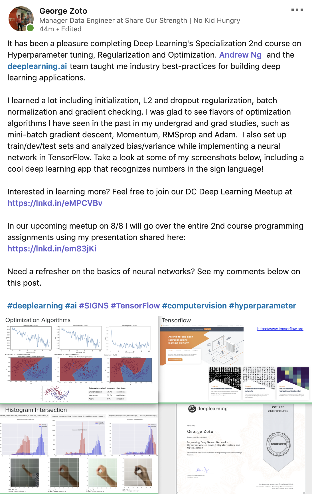
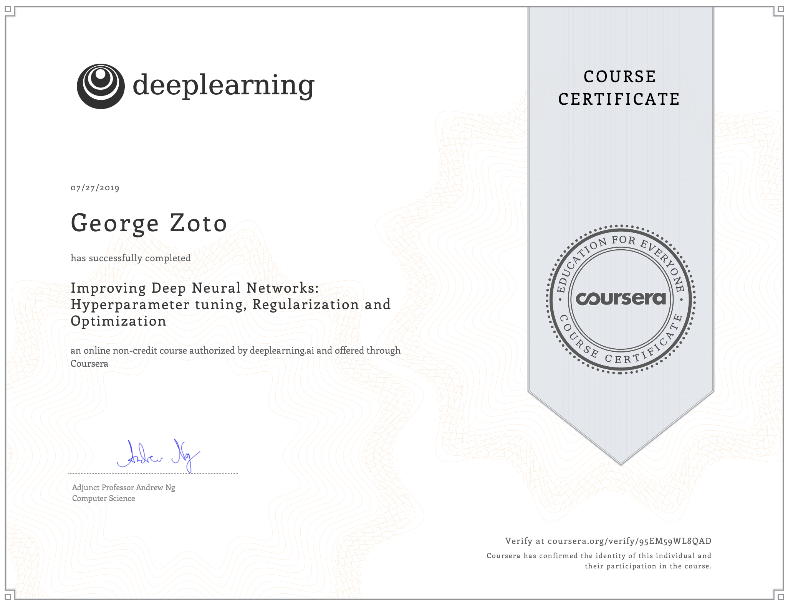

# Hyperparameter-Tuning-Regularization-and-Optimization
Hyperparameter Tuning Regularization and Optimization repository for all projects and programming assignments of Course 2 of 5 of the Deep Learning Specialization offered on Coursera and taught by Andrew Ng, CEO/Founder Landing AI; Co-founder, Coursera; Adjunct Professor, Stanford University; formerly Chief Scientist, Baidu and founding lead of Google Brain.

**Practical aspects of Deep Learning**  
* Recall that different types of initializations lead to different results. Recognize the importance of initialization in complex neural networks and the difference between train/dev/test sets. Diagnose the bias and variance issues in my model. Learn when and how to use regularization methods such as dropout or L2 regularization. Understand experimental issues in deep learning such as Vanishing or Exploding gradients and learn how to deal with them. Use gradient checking to verify the correctness of my backpropagation implementation.

**Optimization algorithms**
* Remember different optimization methods such as (Stochastic) Gradient Descent, Momentum, RMSProp and Adam. Use random minibatches to accelerate the convergence and improve the optimization. Know the benefits of learning rate decay and apply it to my optimization.    

**Hyperparameter tuning, Batch Normalization and Programming Frameworks**  
* Master the process of hyperparameter tuning.  

# Links:  
https://www.coursera.org/learn/deep-neural-network/  
https://www.coursera.org/specializations/deep-learning  
https://www.deeplearning.ai   
https://docs.google.com/presentation/d/1b6I2Ry0WVyt0hIGTr2veZhO00lGJzKi6AmFbZ7lQ1-w/edit?usp=sharing  
https://www.coursera.org/account/accomplishments/verify/95EM59WL8QAD   
